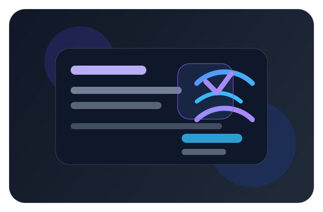
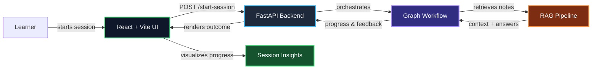
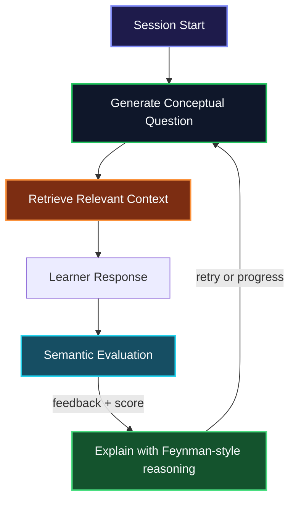

# 🧠 AI Learning Agent



<div align="center">


**An elegant AI tutoring platform that blends retrieval-augmented learning, structured checkpoints, and intelligent feedback into a polished educational workflow.**

</div>

---

## ✨ Overview

The **AI Learning Agent** is a guided study assistant built for active learning. It combines a polished React interface with a FastAPI backend and a graph-driven workflow that adapts learner progress, retrieves source context, and delivers explainable feedback in a tutorial-friendly flow.

### What makes it special

- **Adaptive learning workflow** with checkpoints, retries, and progress tracking.
- **Retrieval-Augmented Generation (RAG)** grounded in curated notes and reference material.
- **Conceptual questioning + Feynman-style explanations** to reinforce understanding.
- **Semantic evaluation** for answer quality, clarity, and conceptual coverage.
- **Modern dashboard UX** designed for responsive study sessions.

---

## 🧩 Core Architecture



---

## 🔁 Learning Loop



---

## 🗂️ Key Modules

| Area | Purpose |
| --- | --- |
| `api.py` | FastAPI entry point and session API surface |
| `app/graph/` | Workflow orchestration and learning graph logic |
| `app/rag/` | Retrieval initialization and RAG setup |
| `app/services/` | Evaluation, retrievers, checkpoints, and session helpers |
| `frontend/` | React + Vite dashboard and study interface |
| `sessions/` | Saved session outputs and progress artifacts |

---

## 🚀 Quick Start

### Prerequisites

- Python 3.10+
- Node.js + npm
- A local virtual environment for Python dependencies

### 1. Start the backend

From the repository root:

```powershell
cd d:\projects\Learning_agent_RAG
.\venv\Scripts\python.exe -m uvicorn api:app --reload --host 127.0.0.1 --port 8000
```

### 2. Start the frontend

```powershell
cd d:\projects\Learning_agent_RAG\frontend
npm install
npm run dev -- --host 127.0.0.1 --port 5173
```

### 3. Open the application

- Frontend: http://127.0.0.1:5173
- Backend API: http://127.0.0.1:8000

---

## 📈 Project Highlights

- **Structured educational workflow** for guided tutoring and checkpoints.
- **Grounded explanations** connected to retrieval context.
- **Performance dashboards** for progress, retries, and session insights.
- **Production-ready patterns** for AI-assisted learning applications.

---

## 🧪 Notes

- The frontend uses `axios` and `react-markdown` for API communication and formatted instructional output.
- The primary learning session begins through `POST /start-session`.
- The repository serves as a practical blueprint for interactive educational agents, retrieval-based context, and adaptive feedback loops.

---

## 🎨 Presentation Notes

This README uses a refined visual structure with:

- **rich status badges** for stack clarity
- **Mermaid graphs** for architecture and learning flow
- **color-coded sections** to highlight major system components and stages

---

## 📄 License

This project is provided for educational, experimental, and development-focused use.

